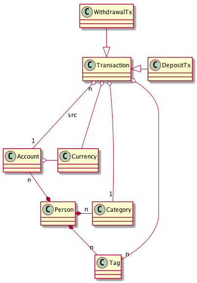

# Проект ведения домашнего бюджета home-budget
## Суть проекта
Проект предназначен для учета пользователем своих ежедневных трат. В конечном счете, данный проект является средством отслеживания, на что тратятся средства (это может быть полезно, например, чтобы лучше планировать собственный бюджет).
## Основные понятия

### Account
**Кошелек (Account)** - условный контейнер, куда пользователь может складывать свои средства. Например, кошелек может соответствовать дебетовой карте, наличным средствам в кошельке или логической "полочке", например "на отпуск" или "подаренные мне на день рождения".
Кошелек может служить источником, откуда пользователь берет деньги, а также может служить получателем (в случае пополнения).
### Transaction
**Транзакция** - любая операция, связанная с деньгами. Данное приложение рассматривает два вида транзакций:
1. внесение (deposit)
2. трата (withdrawal)
 Каждая транзакция, как минимум, имеет следующие атрибуты:
1. дата совершения
2. кошелек, с которым проводится операция
3. сумма операции
4. текстовое обоснование (reason), например "Купил себе лыжи"
5. валюта, в которой совершена операция 
### Category
**Категория** логически группирует транзакции по их смыслу (например, категории могут быть вида "Питание", "Спорт", "Подарки", "Здоровье" etc).
Одна транзакция имеет не более одной категории. Каждый пользователь имеет свой словарь категорий. Категории могут впоследствии использованы для построения отчетов и фильтрации.
### Tag
Опционально пользователь может помечать свои транзакции **тэгами**. Например, тэгами можно отметить те траты, которые были совершены в отпуске, с каким событием связана та или иная покупка и тд.
Словарь тэгов у каждого пользователя свой. Одна транзакция имеет произвольное количество связанных с ней тэгов.